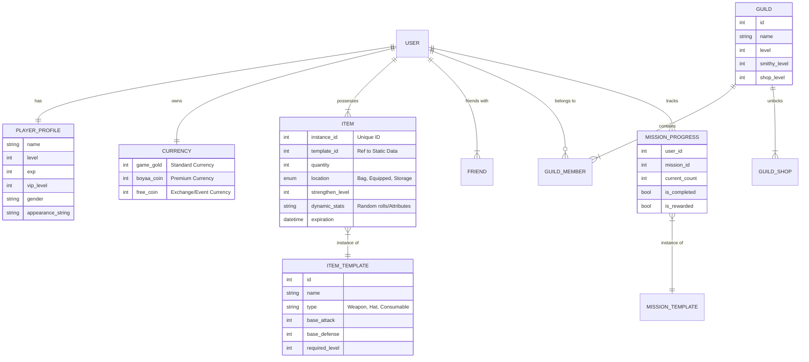

# System Design & Conceptual Data Model (Tauri/Rust Client)

## 1. System Architecture

This design envisions a **Tauri** application serving as the game client. Tauri allows us to write the frontend logic in Rust (or web technologies) while interfacing with the native OS. Since you mentioned "Tauri Rust", we assume a heavy use of Rust for the client-side game logic.

### High-Level Architecture

```mermaid
graph TD
    User[Player] -->|Interacts| Client[Tauri Client (Rust/Web)]

    subgraph "Client Side (Tauri)"
        UI[User Interface] -->|Events| GameLogic[Game Logic Core (Rust)]
        GameLogic -->|State Update| State[Local State Management]
        GameLogic -->|HTTP/WebSocket| Net[Network Layer]
        Net -->|Cache/Config| LocalDB[Local Storage / SQLite]
    end

    subgraph "Server Side"
        Net <-->|API Calls| API[Game Server API]
        API -->|Read/Write| DB[(Central Database)]
        API -->|Auth| Auth[Auth Service]
    end
```

### Components

1.  **Tauri Client**:
    *   **Frontend**: Renders the game. Could be HTML/Canvas/WebGL or a Rust UI framework (like Slint or Dioxus) running inside the webview.
    *   **Core Logic (Rust)**: Handles calculations (stats, battles) to ensure performance and type safety.
    *   **Network Layer**: Manages secure communication with the server. Since it's a private server, you might use standard HTTP/JSON or gRPC for efficiency.

2.  **Server API**:
    *   Central authority for critical data (inventory, currency, battle verification).
    *   Prevents cheating by validating actions sent by the client.

## 2. Business Processes & Logic

Based on the reverse engineering of the original Flash game, here are the core processes adapted for a modern Rust architecture:

### A. Authentication & Session
*   **Original**: `sid` + `win_param` JSON.
*   **New Design**: Use JWT (JSON Web Tokens).
    1.  Client sends credentials.
    2.  Server returns JWT.
    3.  Client stores JWT securely and attaches it to headers.

### B. Inventory & Item Management
*   **Logic**: Items have complex attributes (Synthesis, Strengthening, Expiration).
*   **Process**:
    1.  **Load**: Client fetches `items` list on login.
    2.  **Equip**: User drags item to slot -> Client sends `equip_item(id, slot)` -> Server validates class/level reqs -> Updates DB -> Returns success.
    3.  **Stats**: Client calculates stats locally for display (Attack = Base + Equip + Buffs), but Server re-calculates for battle verification.

### C. Missions (Quests)
*   **Structure**: Missions have sub-tasks (kill X, collect Y).
*   **Process**:
    1.  Client tracks progress locally for UI feedback (e.g., "Ants killed: 4/10").
    2.  Upon completion, Client sends `complete_mission(id)`.
    3.  Server verifies conditions (e.g., did the battle actually happen?) and awards prizes.

### D. Battle System (PvE/PvP)
*   **Turn-Based**: The original game is turn-based artillery/shooter.
*   **Implementation**:
    *   **Client**: Calculates trajectory, collision, and animation.
    *   **Server**: Receives "Shot Data" (Angle, Power, Weapon) or "Turn Result".
    *   **Verification**: Server checks if the damage is plausible given the player's stats to prevent "One Hit Kill" hacks.

## 3. Conceptual Data Model (CDM)

This model focuses on the *entities* and their *relationships*, abstracting away specific database types.



### Entity Descriptions

1.  **User / Account**: The overarching entity for authentication (Username, Password, Auth Provider info).
2.  **Player Profile**: Game-specific character data.
    *   *Attributes*: Name, Sex, Level, VIP Status, Ranking, Win/Loss Record.
    *   *Logic*: Level is derived from EXP.
3.  **Currency**: Separated to track economy easier.
    *   *Types*: Gold (F2P), Coins (Premium/Paid), Vouchers.
4.  **Item (Instance)**: A specific item owned by a player.
    *   *Dynamic Attributes*: Unlike static games, items here have "strengthening" (+1 to +12) and "synthesis" (combining attributes).
    *   *Storage*: `location` field determines if it's on the character (active stats) or in the bag.
5.  **Item Template (Static)**: The definition of items (e.g., "Super Ant Cannon"). Usually stored in JSON/XML or a reference table.
6.  **Guild (Union)**: Social groups.
    *   *Progression*: Guilds have their own levels (Smithy, Shop) which unlock features for members.
7.  **Mission Progress**: Tracks the state of quests.
    *   *State*: New -> In Progress -> Completed -> Rewarded.

## 4. Considerations for Tauri Client

Since you are using Tauri (Rust), you can share data structures between the Client and Server if the Server is also written in Rust.

*   **Shared Models**: Create a `common` crate (library) containing the `structs` for `Item`, `Player`, `Mission`.
    *   *Benefit*: If you update the Item definition, both Client and Server update automatically.
*   **State Management**: Use a library like `tauri-plugin-store` or standard Rust `State` management (Redux-like pattern) to keep the local CDM in sync with the UI.
*   **Security**: Never trust the client. Even though it's a native app, users can manipulate memory. Always validate critical actions (spending money, dealing damage, crafting items) on the backend.
