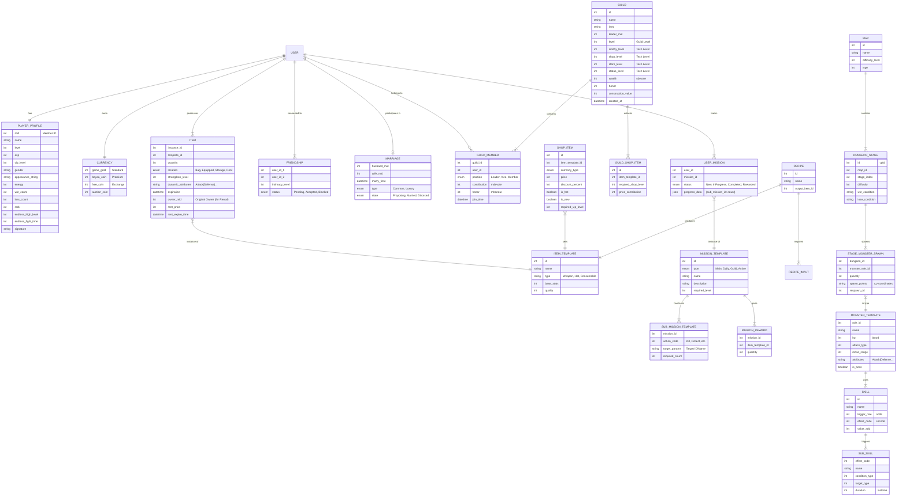

# System Design & Conceptual Data Model (Tauri/Rust Client)

## 1. System Architecture

This design envisions a **Tauri** application serving as the game client. Tauri allows us to write the frontend logic in Rust (or web technologies) while interfacing with the native OS.

### High-Level Architecture

```mermaid
graph TD
    User[Player] -->|Interacts| Client[Tauri Client (Rust/Web)]

    subgraph "Client Side (Tauri)"
        UI[User Interface] -->|Events| GameLogic[Game Logic Core (Rust)]
        GameLogic -->|State Update| State[Local State Management]
        GameLogic -->|HTTP/WebSocket| Net[Network Layer]
        Net -->|Cache/Config| LocalDB[Local Storage / SQLite]
    end

    subgraph "Server Side"
        Net <-->|API Calls| API[Game Server API]
        API -->|Read/Write| DB[(Central Database)]
        API -->|Auth| Auth[Auth Service]
    end
```

## 2. Business Processes & Logic

Based on the reverse engineering of the original Flash game, here are the core processes adapted for a modern Rust architecture:

### A. Authentication & Session
*   **Original**: `sid` + `win_param` JSON.
*   **New Design**: Use JWT (JSON Web Tokens).
    1.  Client sends credentials.
    2.  Server returns JWT.
    3.  Client stores JWT securely and attaches it to headers.

### B. Inventory & Item Management
*   **Logic**: Items have complex attributes (Synthesis, Strengthening, Expiration).
*   **Process**:
    1.  **Load**: Client fetches `items` list on login.
    2.  **Equip**: User drags item to slot -> Client sends `equip_item(id, slot)` -> Server validates class/level reqs -> Updates DB -> Returns success.
    3.  **Rental**: Items can be rented to/from the Guild. The server must track ownership vs. possession and expiration times.

### C. Missions (Quests)
*   **Structure**: Missions have sub-tasks (kill X, collect Y) and rewards.
*   **Process**:
    1.  Client tracks progress locally for UI feedback (e.g., "Ants killed: 4/10").
    2.  Upon completion, Client sends `complete_mission(id)`.
    3.  Server verifies conditions (e.g., did the battle actually happen?) and awards prizes.

### D. Battle System (PvE/PvP)
*   **Turn-Based**: The original game is turn-based artillery/shooter.
*   **Implementation**:
    *   **Client**: Calculates trajectory, collision, and animation.
    *   **Server**: Receives "Shot Data" (Angle, Power, Weapon) or "Turn Result".
    *   **Verification**: Server checks if the damage is plausible given the player's stats.
*   **Dungeons (Copies)**: Players enter stages populated by monsters.
    *   **Spawn Logic**: Server sends spawn points and monster types (`CopyMonster`).
    *   **AI**: Client handles simple AI movement; Server validates positions.

### E. Crafting (Smelting/RLGS)
*   **Logic**: Players combine items based on formulas (Recipes) to create new items (Suits, etc.).
*   **Process**:
    1.  Client sends `smelt_item(recipe_id, [input_item_ids])`.
    2.  Server verifies inputs match the recipe.
    3.  Server consumes inputs and grants the output item.

## 3. Conceptual Data Model (CDM)

This model abstracts away specific database types (SQL vs NoSQL), focusing on Entities and Relationships.



### Entity Descriptions

#### 1. User & Profile
*   **Player Profile**: Stores the core stats. Added `endless_high_level` and `endless_fight_time` for the PvE mode. `appearance_string` stores the avatar configuration ("1|1|1|1").

#### 2. Economy & Items
*   **Item (Instance)**: Expanded to support the **Rental System**.
    *   `owner_mid`: Tracks who actually owns the item if it is currently rented out.
    *   `rent_expire_time`: When the rental period ends.
    *   `dynamic_attributes`: The pipe-separated string stores RNG stats or synthesis results (`synthesisLevel`).
*   **Shop Item**: Defines the general marketplace. Separated from `Item Template` because the same item might be sold for different prices or currencies (Gold vs Coins) or have discounts.

#### 3. Social Structures
*   **Guild (Union)**: A complex entity with multiple progression tracks (`smithy_level`, `shop_level`, etc.).
    *   *Guild Shop*: Unlocks items based on `shop_level`.
*   **Guild Member**: Tracks individual `contribution` (used as currency in Guild Shop) and `honor`.
*   **Friendship**: Basic graph, but includes `intimacy_level` (derived from `familiarity` in source).
*   **Marriage**: Tracks the relationship state and type.

#### 4. Missions (Quest System)
*   **Mission Template**: Defines the static data (Name, Description).
*   **Sub Mission**: Defines the actual logic. `action_code` maps to game events (e.g., Code 101 = Win Battle, Code 102 = Use Item).
*   **User Mission**: Tracks the specific progress of a user. The `progress_data` JSON field is flexible enough to store counts for multiple sub-missions.

#### 5. Crafting (Smelting)
*   **Recipe**: Represents the `RLGS` (Role Login Gift/Smelt) data. Maps input items to an output item.

#### 6. Battle & World
*   **Map**: The visual environment.
*   **Dungeon Stage (Copy)**: Represents a specific playable level within a map (e.g., "Forest Map - Stage 3 - Hard Mode").
*   **Monster Template**: The "Role" or definition of a monster (Base HP, Attack Type).
*   **Stage Monster Spawn**: Configuration for which monsters appear in a specific stage, how many, and where they spawn.
*   **Skill**: Abilities used by players or monsters.
    *   **Sub Skill**: Represents the specific effect (Buff, Damage, Heal) triggered by a skill, often with conditions.

## 4. Tauri/Rust Implementation Notes

### Shared Data Types
To ensure consistency, create a Rust library crate (e.g., `antwars-common`) shared by both the Tauri client and the Server.

```rust
// antwars-common/src/models.rs

#[derive(Serialize, Deserialize, Clone)]
pub struct Item {
    pub id: i64,
    pub template_id: i32,
    pub quantity: i32,
    pub location: ItemLocation, // Enum: Bag, Equipped...
    pub attributes: String,     // "100|20|..."
    pub rental_info: Option<RentalInfo>,
}

#[derive(Serialize, Deserialize, Clone)]
pub struct RentalInfo {
    pub owner_mid: i64,
    pub expire_time: i64, // Unix timestamp
    pub price: i32,
}

#[derive(Serialize, Deserialize, Clone)]
pub struct Guild {
    pub id: i64,
    pub name: String,
    pub levels: GuildTechLevels,
}

#[derive(Serialize, Deserialize, Clone)]
pub struct GuildTechLevels {
    pub shop: i32,
    pub smithy: i32,
    pub store: i32,
    pub statue: i32,
}

// ... Additional structs for Skills, Maps, Monsters
```

### State Management (Client)
In the Tauri app, use a centralized Store (like `Redux` or `useReducer` if using React/Yew, or a `RwLock<GameState>` in pure Rust) to hold:
1.  `inventory`: `Vec<Item>`
2.  `active_missions`: `HashMap<MissionId, Progress>`
3.  `guild_info`: `Option<Guild>`
4.  `skills`: `Vec<Skill>` (Loaded static data)

### Network Sync
1.  **Poll**: Client requests `get_player_state` every X seconds (or after battle).
2.  **Push**: Server pushes updates (e.g., "Guild Level Up", "Friend Request") via WebSocket if real-time features are implemented.

This design covers the missing entities found in the source code analysis (`Guild Levels`, `Rental System`, `Mission Structure`, `Smelting Formulas`, `Skills`, `Maps`, `Monsters`, `Shops`).
